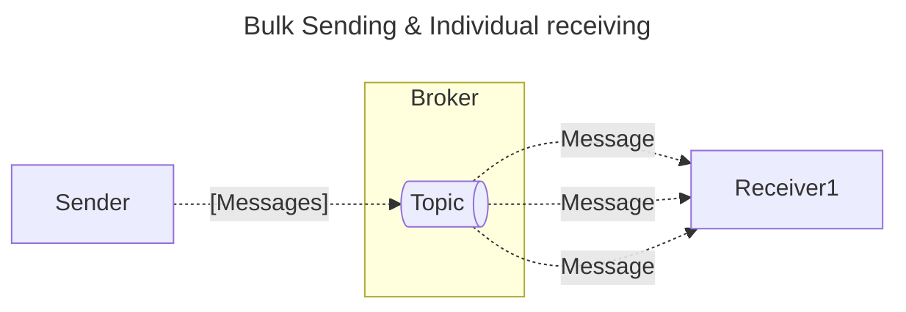

```mermaid
---
title: Bulk Sending & Individual receiving
config:
  theme: light
---
graph LR
    S[Sender]
    subgraph Broker
        T@{ shape: das, label: "Topic" }
    end
    R[Receiver1]
    S -.->|"[Messages]"| T
    T -.->|"Message"| R
     T -.->|"Message"| R
      T -.->|"Message"| R
```

---

```mermaid
---
title: Bulk Sending & Bulk Receiving
config:
  theme: light
---
graph LR
    S[Sender]
    subgraph Broker
        T@{ shape: das, label: "Topic" }
    end
    R[Receiver1]
    S -.->|"[Messages]"| T
    T -.->|"[Messages]"| R
```