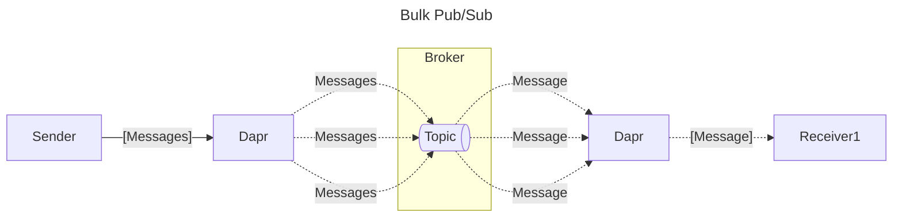
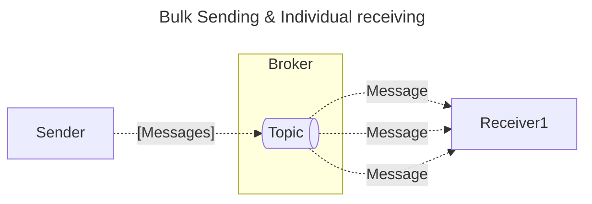
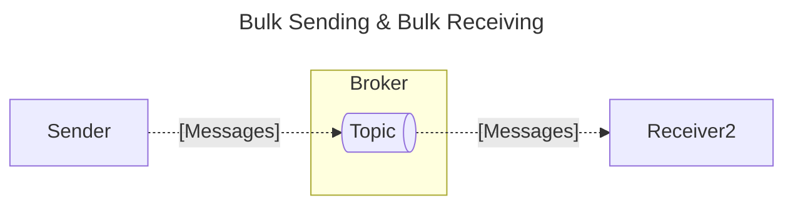

```mermaid
---
title: Bulk Pub/Sub
config:
  theme: light
---
graph LR
    S[Sender]
    SD[Dapr]
    subgraph Broker
        T@{ shape: das, label: "Topic" }
    end
    R[Receiver1]
    RD[Dapr]
    S -->|"[Messages]"| SD
    SD -.->|"Messages"| T
    SD -.->|"Messages"| T
    SD -.->|"Messages"| T
    T -.->|"Message"| RD
    T -.->|"Message"| RD
    T -.->|"Message"| RD
     RD -.->|"[Message]"| R
```

&nbsp;

_Only Kafka, Azure ServiceBus and Azure EventHubs support native bulk messaging with Dapr._

&nbsp;

&nbsp;

---
&nbsp;

&nbsp;

```mermaid
---
title: Bulk Sending & Individual receiving
config:
  theme: light
---
graph LR
    S[Sender]
    subgraph Broker
        T@{ shape: das, label: "Topic" }
    end
    R[Receiver1]
    S -.->|"[Messages]"| T
    T -.->|"Message"| R
     T -.->|"Message"| R
      T -.->|"Message"| R
```

&nbsp;

&nbsp;

---
&nbsp;

&nbsp;

```mermaid
---
title: Bulk Sending & Bulk Receiving
config:
  theme: light
---
graph LR
    S[Sender]
    subgraph Broker
        T@{ shape: das, label: "Topic" }
    end
    R[Receiver2]
    S -.->|"[Messages]"| T
    T -.->|"[Messages]"| R
```