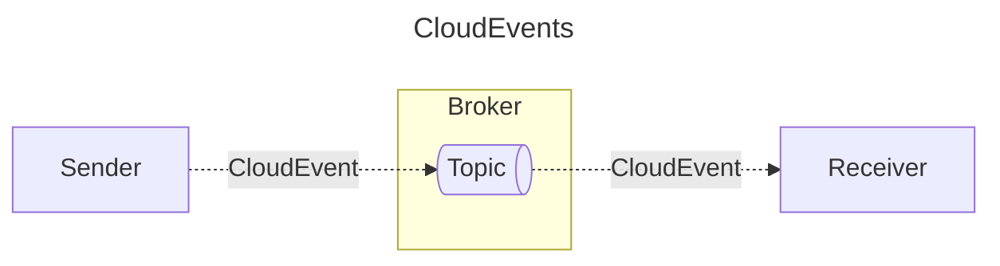

```mermaid
---
title: CloudEvents
config:
  theme: light
---
graph LR
    S[Sender]
    subgraph Broker
        T@{ shape: das, label: "Topic" }
    end
    R[Receiver]
    S -.->|"CloudEvent<Message>"| T
    T -.->|"CloudEvent<Message>"| R
```

[cloudevents.io](https://cloudevents.io/)