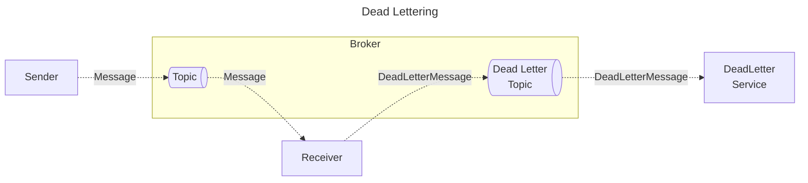

```mermaid
---
title: Dead Lettering
config:
  theme: light
---
graph LR
    S[Sender]
    subgraph Broker
        T@{ shape: das, label: "Topic" }
        DLT@{ shape: das, label: "Dead Letter \nTopic" }
    end
    R[Receiver]
    DLS[DeadLetter
    Service]
    S -.->|Message| T
    T -.->|Message| R
    R -.->|DeadLetterMessage| DLT
    DLT -.->|DeadLetterMessage| DLS
```