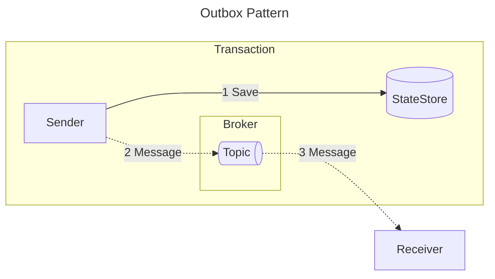

## Commit a single transaction across a state store and pub/sub message broker

```mermaid
---
title: Outbox Pattern
config:
  theme: light
---
graph LR
    S[Sender]
    R[Receiver]
    ST[(StateStore)]
    subgraph Transaction
      subgraph Broker
      T@{ shape: das, label: "Topic" }
      end
        S -.->|2 Message| T
        S --->|1 Save| ST
    end
    T -.->|3 Message| R
```