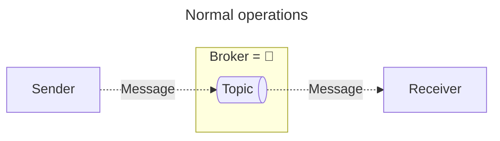
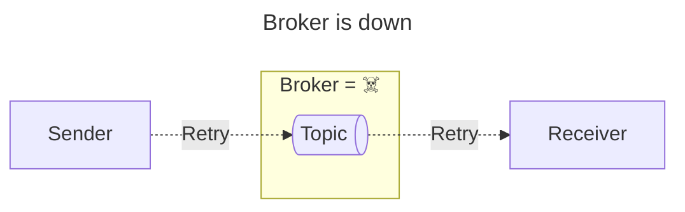

```mermaid
---
title: Normal operations
config:
  theme: light
---
graph LR
    S[Sender]
    subgraph "Broker = 💙"
        T@{ shape: das, label: "Topic" }
    end
    R[Receiver]
    S -.->|Message| T
    T -.->|Message| R
```

---

```mermaid
---
title: Broker is down
config:
  theme: light
---
graph LR
    S[Sender]
    subgraph "Broker = ☠️"
        T@{ shape: das, label: "Topic" }
    end
    R[Receiver]
    S -.->|Retry| T
    T -.->|Retry| R
```