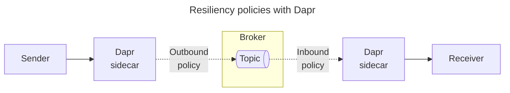

```mermaid
---
title: Resiliency policies with Dapr
config:
  theme: light
---
graph LR
    S[Sender]
    SD[Dapr
    sidecar]
    subgraph "Broker"
        T@{ shape: das, label: "Topic" }
    end
    R[Receiver]
    RD[Dapr
    sidecar]
    S --> SD -.->|Outbound
    policy| T
    T -.->|Inbound
    policy| RD--> R
```

[Dapr Docs: Resiliency Overview](https://docs.dapr.io/operations/resiliency/resiliency-overview/)