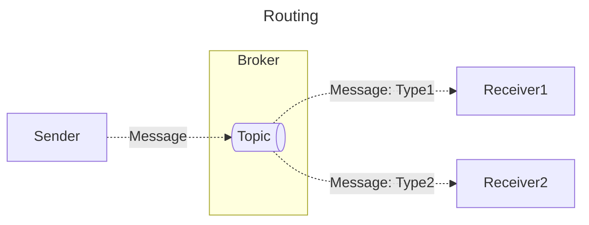

```mermaid
---
title: Routing
config:
  theme: light
---
graph LR
    S[Sender]
    subgraph Broker
    T@{ shape: das, label: "Topic" }
    end
    R1[Receiver1]
    R2[Receiver2]
    S -.->|Message| T
    T -.->|Message: Type1| R1
    T -.->|Message: Type2| R2
```